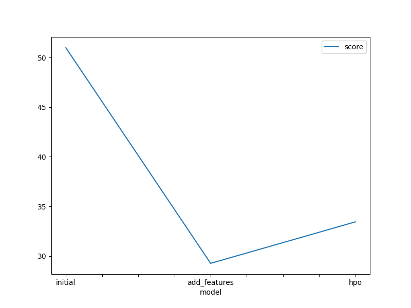
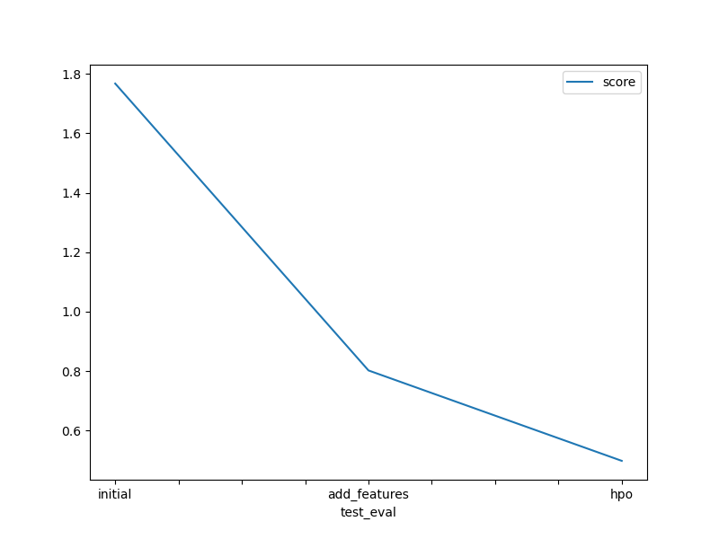

# Report: Predict Bike Sharing Demand with AutoGluon Solution
#### Hongyi Lu

## Initial Training
### What did you realize when you tried to submit your predictions? What changes were needed to the output of the predictor to submit your results?
After data cleaning, feature engineering, and multiple rounds of hyperparameter tuning to enhance model performance, I noticed that the output predictions included negative values, which were not meaningful. To resolve this issue, all negative outputs from the predictor were replaced with 0 to ensure valid submissions. 

### What was the top ranked model that performed?
The top-ranked model was the one trained using hyperparameter optimisation (HPO). This model outperformed the initial and feature-engineered models by having a Kaggle score of 0.49823, which is the lowest among the all. 

## Exploratory data analysis and feature creation
### What did the exploratory analysis find and how did you add additional features?
The EDA provided valuable data insights, which allows me to apply some additional data cleaning and feature engineering to enhance model performance:

- Seperate the datetime column to year, month, day, and hour
- Highly correlated features were identified from the correlation heatmap, so we remove the feature atemp to reduce redundancy
- Additional categorical features were created, including rush_hour, temp_category, wind_category, and humidity_category
- The is_weekend feature was generated based on the workingday column, distinguishing weekends from weekdays
- The season, weather and weekend variables were converted into categorical data types for clarity

### How much better did your model preform after adding additional features and why do you think that is?
After incorporating additional features, the Kaggle score improved from 1.76766 to 0.80239. More importantly, it significantly boosted the performance of the hyperparameter-optimized (HPO) model to 0.498. The inclusion of the new features derived from the original data allowed the model to better understand variations in the target variable. 

## Hyper parameter tuning
### How much better did your model preform after trying different hyper parameters?
Optimising parameters such as the learning rate, number of boosting rounds, etc., helps the model to generalise better with different combinations of settings. 

Hyperparameter tuning significantly improved the model's performance, bringing it close to 0.5. After multiple rounds of feature engineering and fine-tuning, these adjustments ultimately reduced the Kaggle score to 0.49823, though the improvement was not substantial. 

An interesting observation during the project was the impact of using AutoGluon presets for hyperparameter optimization. The 'best_quality' preset aimed to maximise model performance but often required high memory usage and significant computational power. Therefore, lighter and faster presets such as 'medium_quality' and 'high_quality' could be considered as alternatives to balance performance and efficiency. 

### If you were given more time with this dataset, where do you think you would spend more time?

- EDA and Feature Engineering

- Get to know more about Autogluon TabularPredictor and try alternative optimization techniques, such as Bayesian optimization, to refine hyperparameters further. 

### Create a table with the models you ran, the hyperparameters modified, and the kaggle score.
|model|time_limit|nn_learning_rate|num_boost_round|cat_depth|...|score|
|--|--|--|--|--|--|--|
|initial|600|default|default|default|default|1.76766|
|add_features|600|default|default|default|default|0.80239|
|hpo|900|lower=0.0001, upper=0.01|lower=100, upper=500|[6, 8, 10]|...|0.49823|

### Create a line plot showing the top model score for the three (or more) training runs during the project.

### Create a line plot showing the top kaggle score for the three (or more) prediction submissions during the project.

## Summary
In this project, I explored various techniques to improve the predictive accuracy of the model. Feature engineering played a crucial role in boosting performance by extracting meaningful information from the data. Hyperparameter tuning further optimised the model, which significantly reduces the Kaggle score. 

AutoGluon was a new framework for me, and I found it to be highly effective in machine learning applications. I am eager to spend more time exploring its functionality and applying it to real-world scenarios in the future. 

